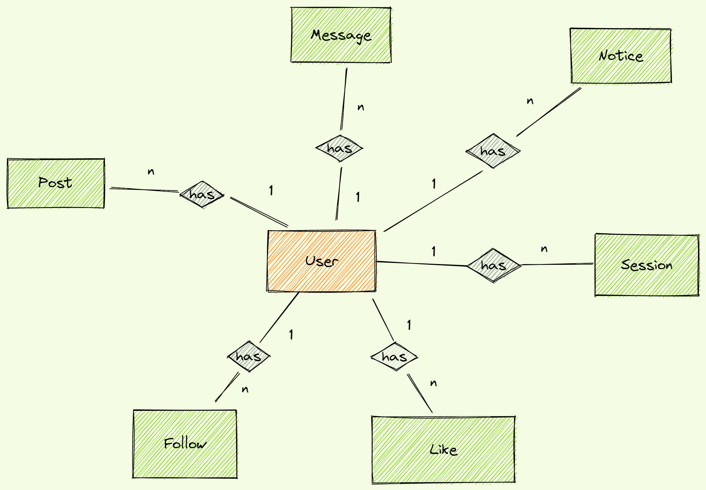
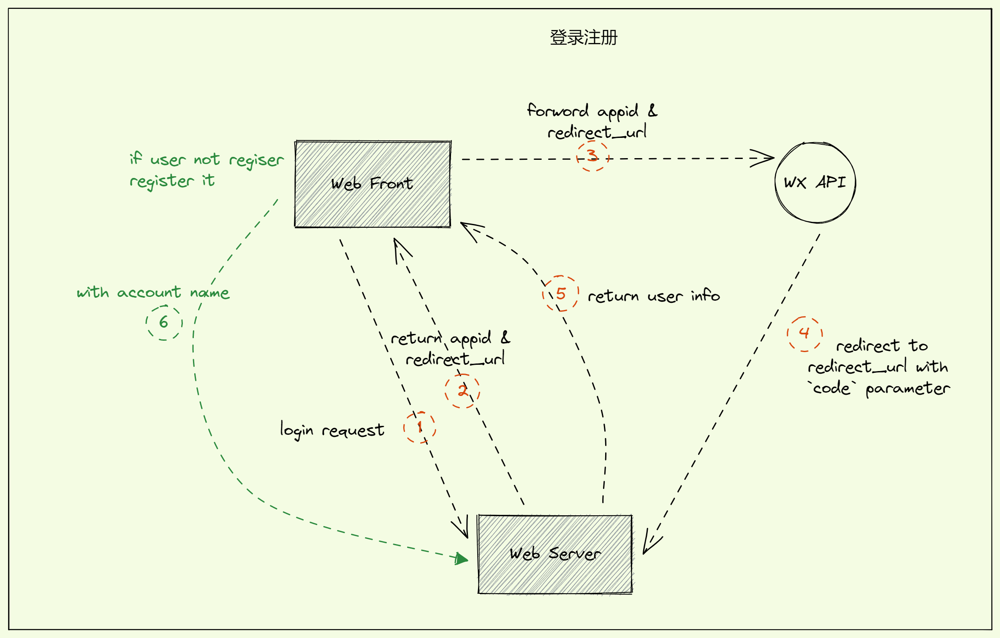
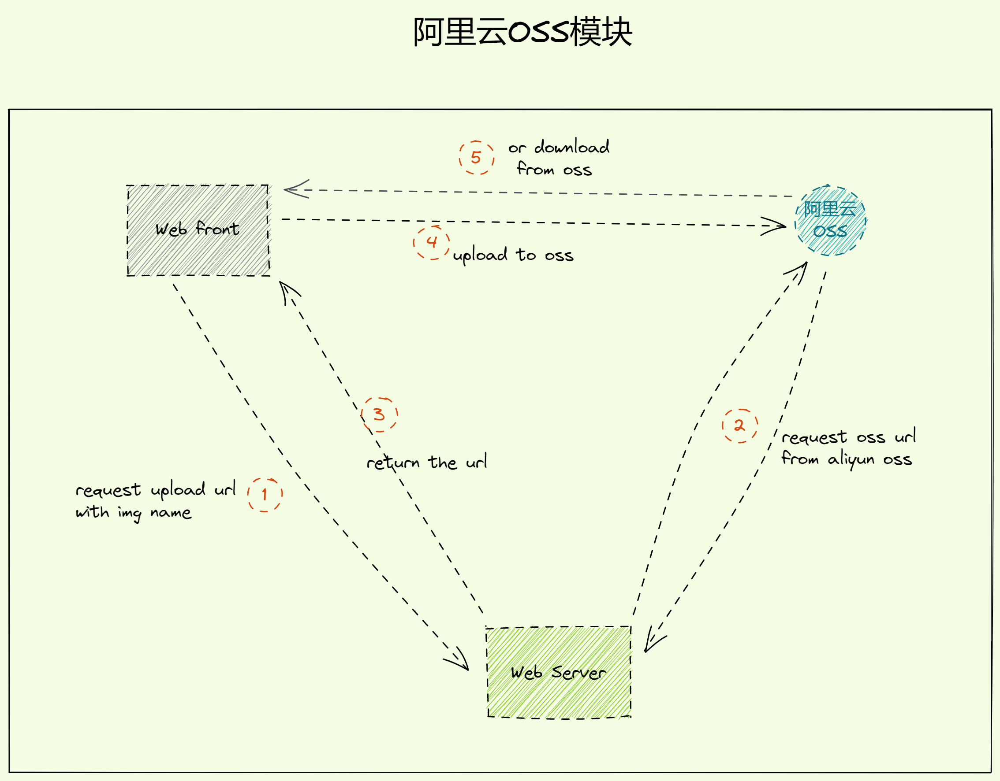

# feed-server

- [feed-server](#feed-server)
  - [数据库模型设计](#数据库模型设计)
    - [User](#user)
    - [Session](#session)
    - [Follow](#follow)
    - [Like](#like)
    - [Post](#post)
    - [Message](#message)
    - [Notice](#notice)
  - [后端API接口设计](#后端api接口设计)
    - [用户模块](#用户模块)
      - [登陆注册功能](#登陆注册功能)
      - [关注功能](#关注功能)
    - [帖子模块](#帖子模块)
      - [阿里云的OSS功能](#阿里云的oss功能)
      - [帖子的CURD](#帖子的curd)
  - [设计想法](#设计想法)
  - [some tips](#some-tips)
    - [2022.8.4](#202284)

## 数据库模型设计



### User

> 用户表

```ts
type User =  {
    _id: ObjectId,
    // 账号
    account: string,            // begin at `@`
    // 微信id
    wxId: string,               // `wx` openId
    // 昵称
    nickname: string,           // from `wx`
    // 个人简介
    bio: string,   
    // 头像url
    avatar: string,             // url, from `wx`
    // 背景图url
    background: string,         // url
    // 创建时间
    createdAt: number,
}

```

### Session

> 会话

```ts
type Session = {
    _id: ObjectId,
    // session _id
    sid: string,            
    // 微信的access_token
    // wxAccessToken: string,
    // 微信的刷新token refresh_token
    // wxRefreshToken: string,     // `wx` 用于刷新 `access_token`
    // session创建时间
    createdAt: number,          // 创建时间
    // 用户ip
    ip: string,                 // 登录的ip
}
```

### Follow

> 关注

```ts
type Follow = {
    _id,
    // 关注者id
    userId: string,            
    // 被关注者id
    followedId: string,         
    // 关注时间
    createdAt: number,            
}
```

### Like

> 喜欢

```ts
type Like= {
    _id,
    // 用户id
    userId: string,
    // 帖子 _id
    postId: string,
    // 创建时间
    createAt: number,
}
```

### Post

> 帖子或评论

```ts
// enum PostType {
//     Default = 1,
//     Comment = 2,
//     Repost = 3, 
// }

type Post = {
    _id: ObjectId,
    // 用户Id
    userId: ObjectId,
    // 帖子类型
    type: PostType,
    // 关联的帖子
    relativeId: ObjectId | null,
    // 创建时间
    createdAt: number,
    // 内容
    content: string,
    // 图片 `url`列表
    images: []string,
    // 转发数
    reposts: number
    // 评论数
    comments: number
    // 喜欢数
    likes: number
    // 是否删除
    isDeleted: boolean
}

```

### Message

> 私信

```ts
type Message = {
    
}

```

### Notice

> 通知

## 后端API接口设计

### 用户模块

#### 登陆注册功能



```ts
GET /api/user/wxlogin
return {
    code,
    data: {
        wxUri: string,        // 前端调用该 `uri` 获取用户信息
    },
}


GET /api/user/login
query {
    code: string
}
return {
    code,
    data: {
        _id: string,
        // 账号
        account: string | null,     // begin at `@`,  `null` represent that this user is not registered, so need you recall `register` api
        // 微信id
        wxId: string,               // `wx` openId
        // 昵称
        nickname: string,           // from `wx`
        // 个人简介
        bio: string,   
        // 头像url
        avatar: string,             // url, from `wx`
        // 背景图url
        background: string,         // url
        // 创建时间
        createdAt: number,
    },
}

POST /api/user/register
post {
    account: string
}
return {
    code,
    data: {
        ok: boolean,                // `false` represent that the `account` has been registered, so need you repost a account.
    }
}
```

#### 关注功能

```ts
POST /api/user/follow
body {
    followedId: string,   // 被关注者 _id
}
return {
    code,
    body: {
        ok: boolean,
    },
}
```

### 帖子模块

#### 阿里云的OSS功能



```ts
// 上传
POST /api/img/upload
body {
    imgName: string,    // 图片名称
}
return {
    code,
    data: {
        url: string,    // 上传至OSS的url
    }
}

// 下载
GET /api/img/download
query {
    type?: string,      // 下载类型 `default` or `origin`，默认值`default`
    imgUrl: string,     //  下载的图片url
}
return {
    code,
    data: {
        url: string,    // 下载的OSS url
    }
}

```

#### 帖子的CURD

> 发帖，看帖，删帖，评论，转发，喜欢

```ts
// 发帖, 转发和评论
POST /api/post/add
body {
    // 用户id
    userId: string,
    // 关联的 postId
    relativeId: string,
    // 内容
    content: string,
    // 图片 `url`列表
    images: []string,
}
return {
    code,
    data: {
        ok: boolean,
        postId: string,
    }
}

/**
 *  list all posts，`default`, `forward`, `comment`
 *  默认 `default`  + `forward`
 *  descend sorted by createdAt
 */
GET /api/post/list
query {
    default: boolean,
    repost: boolean,
    comment: boolean,
}
return {
    code,
    data: {
        // 用户Id
        userId: string,
        // 帖子类型 0 default, 1 comment, 2 repost
        type: number,
        // 关联的帖子
        relativeId: ObjectId | null,
        // 创建时间
        createdAt: number,
        // 内容
        content: string,
        // 图片 `url`列表
        images: []string,
        // 转发数
        reposts: number
        // 评论数
        comments: number
        // 喜欢数
        likes: number
    }[]
}

// 删贴，包括原创，转发，评论
POST /api/post/delete
body {
    postId: string,
}
return {
    code,
    data: {
        ok: boolean,
    },
}

// 喜欢
POST /api/post/like
query {
    postId: string,
}
return {
    code,
    data: {
        ok: boolean,
    },
}
```

## 设计想法

1. redis 缓存_id 关注

2. web-socket实时通讯

3. 通过web-socket向前端页面植入自定义程序

## some tips

### 2022.8.4

1. `!!`写法

```ts
user.hasFollowed = !!(await follows.findOne({
    userId: new ObjectId(userId),
    followedId: new ObjectId(user._id)
}));
```

一个`!`将对象变为`boolean`但是值是反的, 第二个`!`反过来
